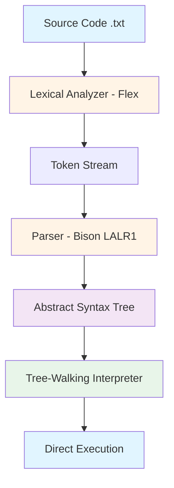
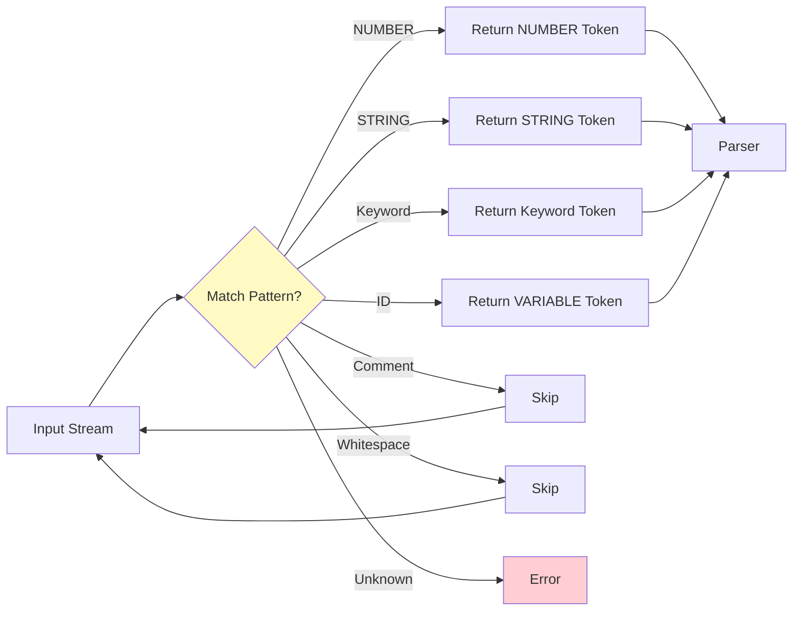
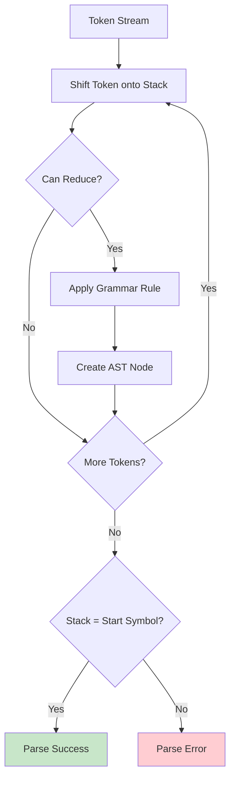
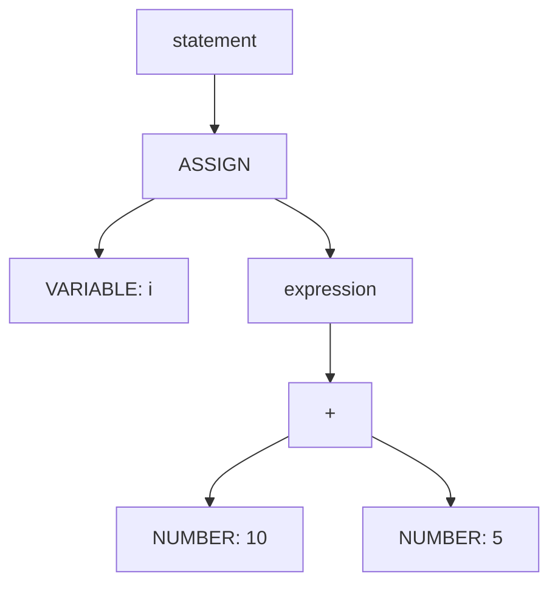
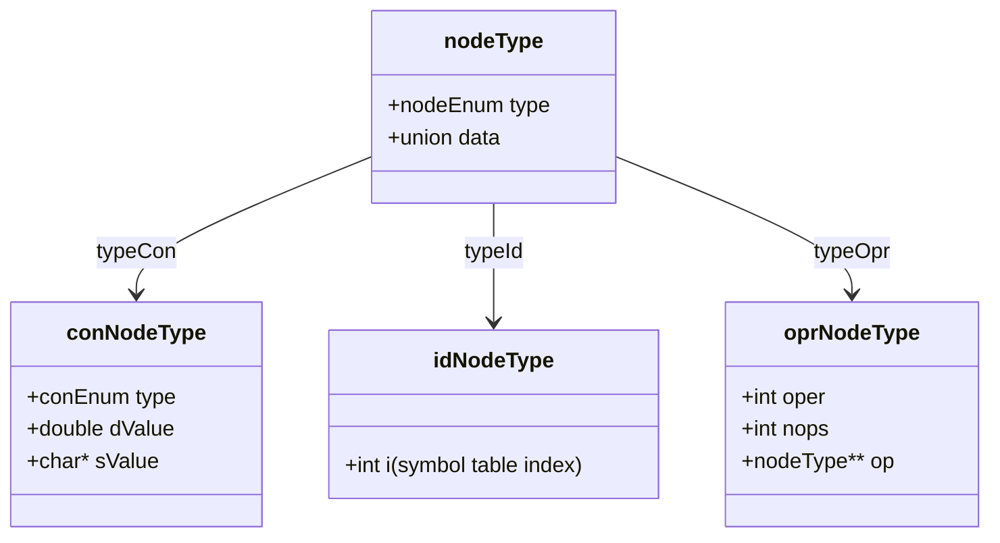
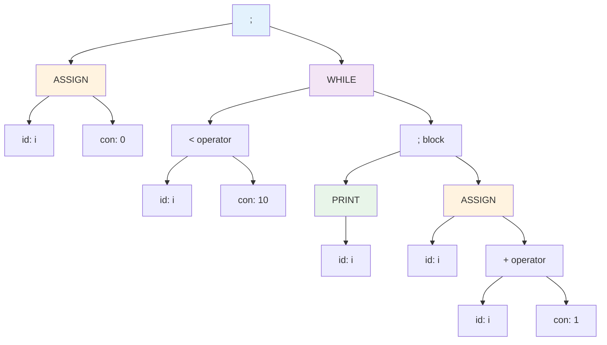
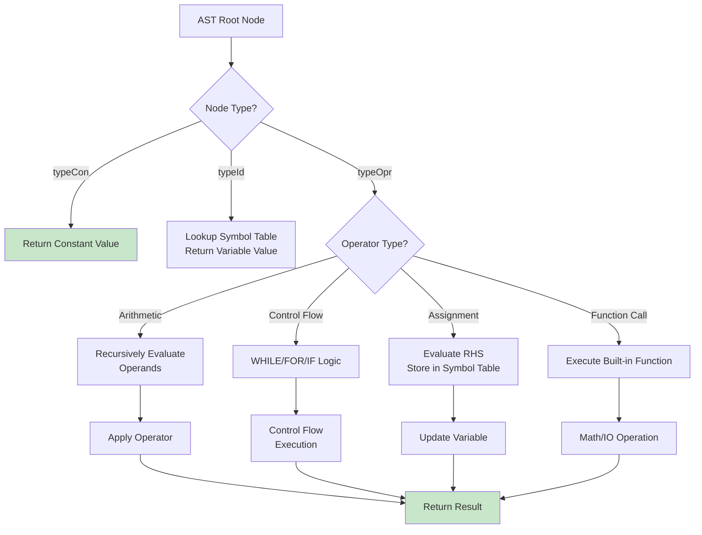
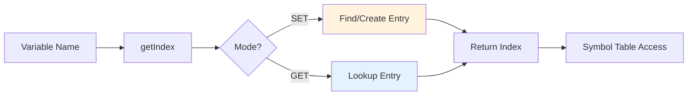
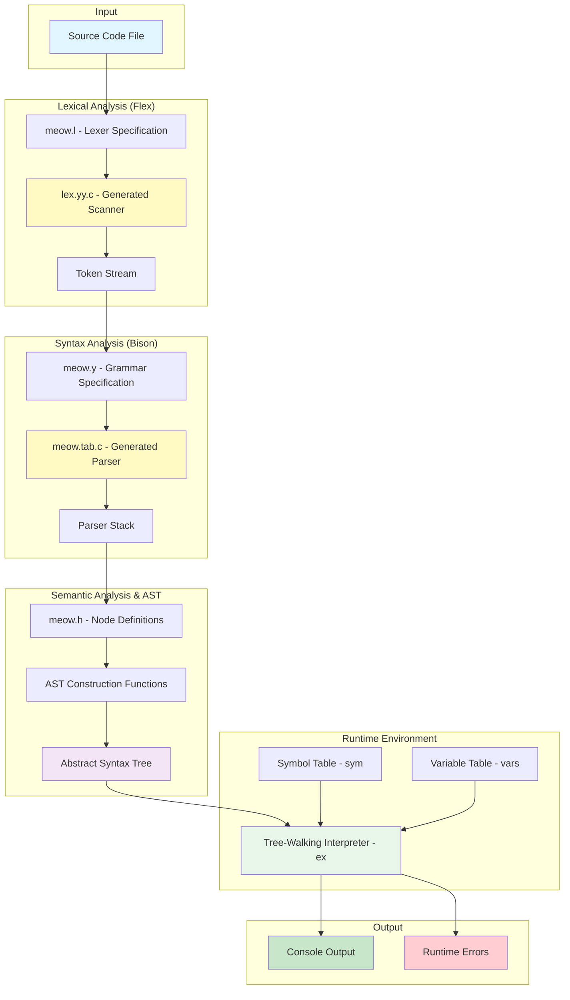

🐱

## *Meow Programming Language*
A simple and light programming language for basic problem solving and calculation.

<br/>

---

## **Compiler Architecture**

### **Overview**
The Meow compiler is a **tree-walking interpreter** built using classic compiler construction tools (Flex and Bison). It follows a traditional compilation pipeline with lexical analysis, syntax parsing, and Abstract Syntax Tree (AST) construction, followed by direct interpretation of the AST.

### **Compilation Pipeline**



---

## **1. Lexical Analysis (Scanner)**

### **Implementation**: [meow.l](meow.l) using **Flex**

The lexical analyzer (lexer) is the first phase of compilation. It reads the source code as a stream of characters and converts it into a stream of **tokens** (lexemes).

### **Key Responsibilities**
- **Pattern Matching**: Uses regular expressions to identify tokens
- **Token Generation**: Converts matched patterns into token types
- **Comment Removal**: Strips single-line comments starting with `#`
- **Error Detection**: Reports improperly terminated strings and unknown characters
- **Line Tracking**: Maintains line numbers for error reporting

### **Token Categories**

| Token Type | Pattern | Examples |
|------------|---------|----------|
| **NUMBER** | `[0-9]+(\.[0-9]*)?([Ee][+-]?[0-9]+)?` | `42`, `3.14`, `2.5e-3` |
| **STRING** | `"[^"\n]*["\n]` | `"Hello World"` |
| **VARIABLE** | `[a-zA-Z][a-zA-Z0-9_]*` | `counter`, `myVar_1` |
| **KEYWORDS** | Fixed strings | `while`, `for`, `if`, `print`, `scan` |
| **OPERATORS** | Single/multi-char | `+`, `-`, `*`, `/`, `^`, `:=`, `>=`, `<=`, `!=` |
| **DELIMITERS** | Single characters | `(`, `)`, `;`, `,`, `{`, `}` |
| **MATH FUNCTIONS** | Fixed strings | `sin`, `cos`, `log`, `sqrt`, `abs` |

### **Lexical Analysis Flow**



### **Example Tokenization**
```meow
i := 10;
print i + 5;
```

**Token Stream**:
```
VARIABLE("i") → ASSIGN → NUMBER(10) → ';' 
→ PRINT → VARIABLE("i") → '+' → NUMBER(5) → ';'
```

---

## **2. Syntax Analysis (Parser)**

### **Implementation**: [meow.y](meow.y) using **Bison (LALR(1) Parser)**

The parser performs **syntax analysis**, verifying that the token stream follows the grammar rules of the Meow language. It constructs an **Abstract Syntax Tree (AST)** representing the program's structure.

### **Parser Type: LALR(1)**

- **LALR** = Look-Ahead LR (Left-to-right scan, Rightmost derivation)
- **Look-ahead**: 1 token
- **Parsing Method**: Bottom-up, shift-reduce
- **Generated by**: GNU Bison

### **Grammar Structure**

```bnf
program → function
function → ε | function statement

statement → ';'
          | expression ';'
          | EXIT ';'
          | VARIABLE ASSIGN expression ';'
          | PRINT expression ';'
          | PRINT STRING ';'
          | SCAN VARIABLE ';'
          | WHILE expression THEN statement
          | FOR VARIABLE ':' '(' expr ',' expr ',' expr ')' THEN statement
          | IF expression THEN statement
          | IF expression THEN statement ELSE statement
          | '{' statement_list '}'

statement_list → statement | statement_list statement

expression → NUMBER | VARIABLE | PI
           | expression binary_op expression
           | unary_op expression
           | function_call
           | '(' expression ')'
```

### **Operator Precedence & Associativity**

From **lowest** to **highest** precedence:

| Precedence | Operators | Associativity | Description |
|------------|-----------|---------------|-------------|
| 1 | `or` | left | Logical OR |
| 2 | `and` | left | Logical AND |
| 3 | `>=`, `<=`, `=`, `!=`, `>`, `<` | left | Comparison |
| 4 | `+`, `-` | left | Addition, Subtraction |
| 5 | `*`, `/`, `%` | left | Multiplication, Division, Modulo |
| 6 | `not` | left | Logical NOT |
| 7 | `^` | left | Exponentiation |
| 8 | `-` (unary) | non-assoc | Unary minus (UMINUS) |

### **Parsing Process**



### **Example Parse Tree**

**Input**: `i := 10 + 5;`



---

## **3. Abstract Syntax Tree (AST)**

### **Implementation**: [meow.h](meow.h) and [meow.y](meow.y)

The AST is a tree representation of the program's syntactic structure. Each node represents a construct in the source code.

### **Node Types**

```c
typedef enum {
    typeCon,    // Constant (number or string)
    typeId,     // Identifier (variable)
    typeOpr     // Operator (expressions, statements)
} nodeEnum;
```

### **AST Node Structure**



### **AST Construction Functions**

| Function | Purpose | Example |
|----------|---------|---------|
| `cond(dValue)` | Create constant number node | `cond(42.0)` |
| `cons(sValue)` | Create constant string node | `cons("Hello")` |
| `id(vName, mode)` | Create identifier node | `id("counter", GET)` |
| `opr(oper, nops, ...)` | Create operator node | `opr('+', 2, left, right)` |

### **Example AST**

**Code**: 
```meow
i := 0;
while i < 10 then {
    print i;
    i := i + 1;
}
```

**AST Representation**:


### **AST Memory Management**

- **Allocation**: Dynamic memory allocation using `malloc()`
- **Deallocation**: Recursive tree traversal with `freeNode()`
- **Lifecycle**: Build → Execute → Free

---

## **4. Intermediate Representation (IR)**

### **Approach: Direct AST Interpretation**

Unlike traditional compilers that generate bytecode or assembly, Meow uses the **AST itself as the intermediate representation**. This design choice simplifies the implementation while maintaining interpretability.

### **Why AST as IR?**

| Aspect | Traditional IR | AST as IR (Meow) |
|--------|----------------|------------------|
| **Representation** | Linear bytecode/3-address code | Tree structure |
| **Optimization** | Complex, multiple passes | Minimal |
| **Execution Speed** | Fast (compiled to machine code) | Moderate (interpreted) |
| **Implementation** | Complex | Simple |
| **Memory Overhead** | Lower | Higher (tree structure) |
| **Best for** | Production compilers | Educational/scripting |

### **Execution Model: Tree-Walking Interpreter**

The `ex()` function recursively traverses the AST and executes each node:

```c
double ex(nodeType *p) {
    switch (p->type) {
        case typeCon: return p->con.dValue;
        case typeId:  return sym[p->id.i];
        case typeOpr:
            // Recursively evaluate operands
            // Perform operation
            // Return result
    }
}
```

### **Interpreter Execution Flow**



### **Symbol Table Management**

```c
double sym[SYMSIZE];        // Stores variable values
char vars[SYMSIZE][IDLEN];  // Maps variable names to indices
```

**Operations**:
- **SET Mode**: Initialize new variable or update existing
- **GET Mode**: Retrieve variable value (error if uninitialized)



---

## **Detailed Architecture Diagram**



---

## **Execution Flow Example**

**Source Code**:
```meow
x := 5;
y := x * 2 + 3;
print y;
```

### **Step-by-Step Execution**

1. **Lexical Analysis**:
   ```
   VARIABLE(x) ASSIGN NUMBER(5) ';'
   VARIABLE(y) ASSIGN VARIABLE(x) '*' NUMBER(2) '+' NUMBER(3) ';'
   PRINT VARIABLE(y) ';'
   ```

2. **Parsing & AST Construction**:
   - Statement 1: `ASSIGN(id(x), con(5))`
   - Statement 2: `ASSIGN(id(y), +(*(id(x), con(2)), con(3)))`
   - Statement 3: `PRINT(id(y))`

3. **Interpretation**:
   - Execute: `sym[0] = 5` (x is at index 0)
   - Execute: `sym[1] = sym[0] * 2 + 3 = 13` (y is at index 1)
   - Execute: `print sym[1]` → Output: `13`

---

## **Performance Characteristics**

| Phase | Time Complexity | Space Complexity |
|-------|-----------------|------------------|
| **Lexical Analysis** | O(n) | O(1) |
| **Parsing** | O(n) | O(n) |
| **AST Construction** | O(n) | O(n) |
| **Interpretation** | O(n × d) | O(n) |

Where:
- `n` = Number of tokens/nodes
- `d` = Average tree depth

---

## **Key Design Decisions**

1. **LALR(1) Parser**: Efficient bottom-up parsing with good error recovery
2. **Tree-Walking Interpreter**: Simple implementation, no code generation phase
3. **Direct Execution**: No bytecode compilation, immediate execution of statements
4. **Global Symbol Table**: All variables are globally scoped
5. **Dynamic Typing**: Only numeric (double) and string types

---

#### *Commands to create compiler `kitty`*
```bash
bison -d meow.y      # Generate parser (meow.tab.c, meow.tab.h)
flex meow.l          # Generate lexer (lex.yy.c)
gcc -o kitty lex.yy.c meow.tab.c -lm  # Compile and link with math library
```
<br/>

#### *Run program*
1. ***Interactive mode*** command is `kitty`.
2. ***To run a script***, command is `kitty <file-name>.txt`.<br/>For example, `kitty sample-programs/8_prime_numbers.txt`.

<br/>

#### *Table of content*
| Topic | Description |
| :---: | --- |
| Data types | `Numbers`: Default data type. Similar to C double data type.<br/>`String`: Similar to C character array. |
| Variables initialization | All variables are initialized globally.<br/>***variablename := expression;***<br/><br/>`i := 0;`<br/>`firstVariable := -21.5;` |
| Comment | Single line comment starts with `#` character.<br/><br/>`# This is a comment` |
| Print statement | Prints expression or string without newline.<br/><br/>***print expression;***<br/>`print 10+20;`<br/>`print firstVariable;`<br/><br/>***print string;***<br/>`print "Hello world\n";` |
| Scan statement | Only works in interactive mode.<br/>***scan variable;***<br/><br/>`scan firstVariable;` |
| Operators | Precedence:<br/><ol><li>***( expression )***<br>`print (10+20)/3;` `Output: 10`</li><br/><li>***^***: Exponent<br>`print 8.3^2;` `Output: 68.89`</li><br/><li>***not***: Logical NOT<br>`print not 0;` `Output: 1`</li><br/><li>***\**** : Multiplication<br/>`print 2*4;` `Output: 8`<br/><br/>***/*** : Division<br/>`print 4/2;` `Output: 2`<br/><br/>***%*** : Modulus<br/>`print 11%3;` `Output: 2`</li><br/><li>***+*** : Plus<br/>`print 4+2;` `Output: 6`<br/><br/>***-*** : Minus<br/>`print 4-2;` `Output: 2`</li><br/><li>***>=*** : Grater than or equal<br/>`print 11 >= 4.2;` `Output: 1`<br/><br/>***<=*** : Less than or equal<br/>`print 11 <= 11;` `Output: 1`<br/><br/>***=*** : Equal to<br/>`print 4 = 4;` `Output: 1`<br/><br/>***!=*** : Not equal to<br/>`print 4 != 4;` `Output: 0`<br/><br/>***>*** : Grater than<br/>`print 4 > 2;` `Output: 1`<br/><br/>***<*** : Less than<br/>`print 4 < 2;` `Output: 0`</li><br/><li>***and*** : Logical AND<br/>`print 1 and 0;` `Output: 0`<br/><br/>***or*** : Logical OR<br/>`print 1 or 0;` `Output: 1`</li></ol> |
| If Else | <ul><li>***if expression then statement***<br/>`if not 0 then print "Hello\n";`</li><br/><li>***if expression then statement***<br/>***else statement***<br/><br/>`if 0 then print "Zero\n";`<br/>`else print "Not zero";`</li><br/><li>***if expression then statement***<br/>***else if expression then statement***<br/>***else statement***<br/><br/>`number1 := -10;`<br/>`number2 := -7;`<br/>`if number1 = number2 then print "number1 = number2";`<br/>`else if number1 > number2 then print "number1 > number2";`<br/>`else print "number1 < number2";`<br/></li></ul> |
| While loop | ***while expression then statement***<br/><br/>`i := 0;`<br/>`while i < 10 then {`<br/>&nbsp;&nbsp;&nbsp;&nbsp;`print i;`<br/>&nbsp;&nbsp;&nbsp;&nbsp;`print "\n";`<br/>&nbsp;&nbsp;&nbsp;&nbsp;`i := i + 1;`<br/>`}` |
| For loop | ***for variable : (start, end, step) then statement***<br/>Where,<br/>&nbsp;&nbsp;&nbsp;&nbsp;&nbsp;&nbsp;&nbsp;&nbsp;`variable`: A pre-initialized variable.<br/>&nbsp;&nbsp;&nbsp;&nbsp;&nbsp;&nbsp;&nbsp;&nbsp;`start`: An expression defining where to start the loop.<br/>&nbsp;&nbsp;&nbsp;&nbsp;&nbsp;&nbsp;&nbsp;&nbsp;`end`: An expression defining when to end the loop.<br/>&nbsp;&nbsp;&nbsp;&nbsp;&nbsp;&nbsp;&nbsp;&nbsp;`step`: An expression defining the value variable will be incremented with.<br/><br/>Example 1:<br/>`i := 0;`<br/>`for i : (0, 5, 1) then print i;`<br/>`Output: 0 1 2 3 4`<br/><br/>Example 2:<br/>`i := 0;`<br/>`for i : (5, 0, -1) then print i;`<br/>`Output: 5 4 3 2 1`<br/><br/>Pseudocode for example 1:<br/>`initialize i ← 0`<br/>`set start as reference to i`<br/>`set start ← 0, end ← 5, step ← 1`<br/>`while (start < end) do`<br/>&nbsp;&nbsp;&nbsp;&nbsp;`execute statements`<br/>&nbsp;&nbsp;&nbsp;&nbsp;`start ← start + step`<br/>`end while` |
| Exit program | Keyword `exit` terminates the program.<br/>`exit;` |
| Random number | ***random(lower, upper)***<br/>Returns a randomly generated number within lower to upper.<br/>`print random(1.21, 3.15);` |
| Necessary maths | <ul><li>***abs(x)***<br/>Returns absolute value of given number.<br/>`print abs(-21.65);` `Output: 21.65`</li><br/><li>***sqrt(x)***<br/>Returns square root `√x` of given number.<br/>`print sqrt(81);` `Output: 9`</li><br/><li>***floor(x)***<br/>Returns the nearest integer less than given argument.<br/>`print floor(31.91);` `Output: 31`</li><br/><li>***ceil(x)***<br/>Returns the nearest integer grater than given argument.<br/>`print ceil(31.91);` `Output: 32`</li></ul> |
| Logarithm | ***<ul><li>log(x)***<br/>Returns natural logarithm of a number x with base e.<br/>`print log(10);` `Output: 2.302585`<br/><br/>***log(x, base)***<br/>Returns natural logarithm of a number x with base given as parameter.<br/>`print log(100, 2);` `Output: 6.643856`</li><br/><li>***exp(x)***<br/>Returns `e` (2.71828) raised to the power of the given argument.<br/>`print exp(10);` `Output: 22026.465795`</li></ul> |
| Trigonometry | <ul><li>***PI***<br/>The keyword PI `π` returns the ratio of a circle’s circumference to its diameter.<br/>`print PI;` `Output: 3.141593`</li><br/><li>***sin(x)***<br/>Returns the sine of an argument (angle in radian).<br/>`print sin(PI/2);` `Output: 1`<br/><br/>***asin(x)***<br/>It takes a single argument (-1 ≤ x ≤ -1), and returns the arc sine (inverse of sin) in radian.<br/>`print asin(0.5);` `Output: 0.523599`</li><br/><li>***cos(x)***<br/>Returns the cosine of an argument (angle in radian).<br/>`print cos(PI/2);` `Output: 0`<br/><br/>***acos(x)***<br/>It takes a single argument (-1 ≤ x ≤ -1), and returns the arc cosine (inverse of cosine) in radian.<br/>`print acos(0.5);` `Output: 1.047198`</li><br/><li>***tan(x)***<br/>Returns the tangent of an argument (angle in radian).<br/>`print tan(PI/4);` `Output: 1`<br/><br/>***atan(x)***<br/>It takes a single argument, and returns the arc tangent (inverse of tangent) in radian.<br/>`print atan(0.5);` `Output: 0.463648`</li></ul> |
 
<br/>


